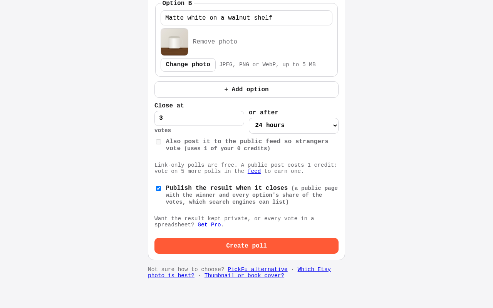
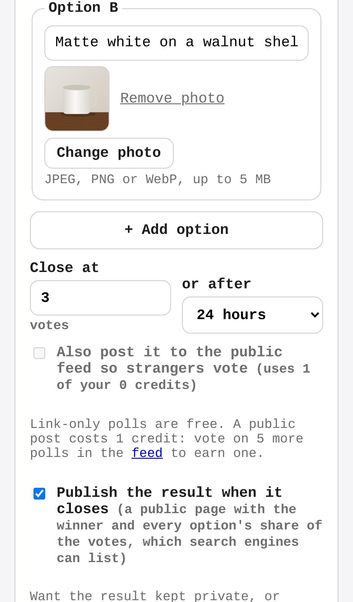
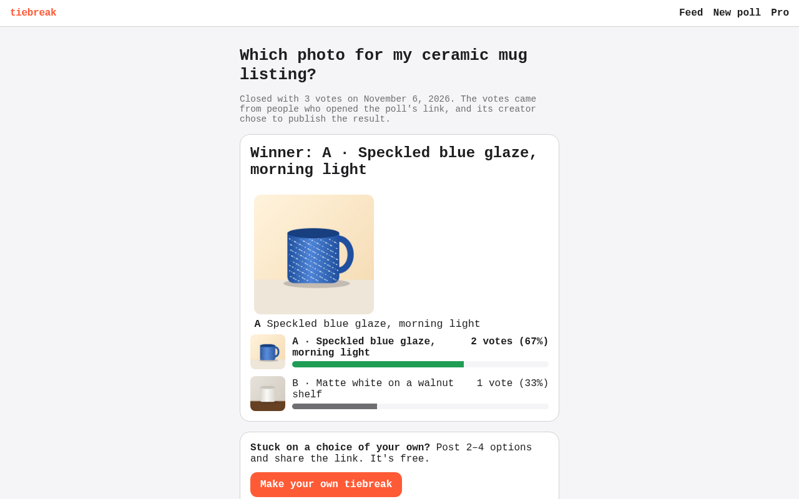
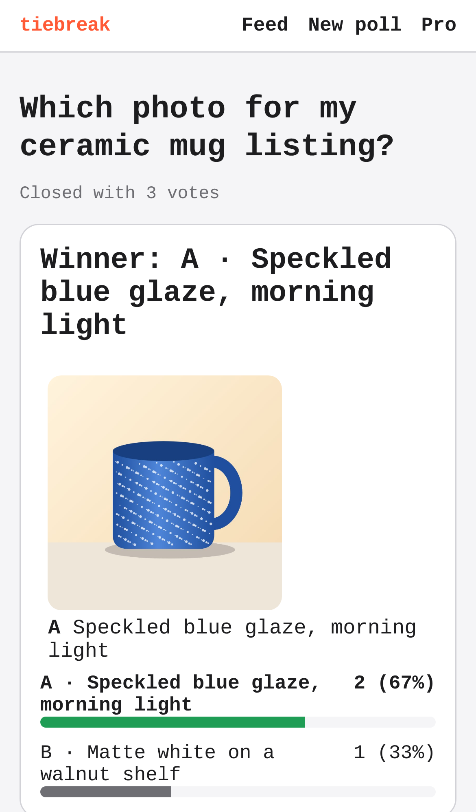
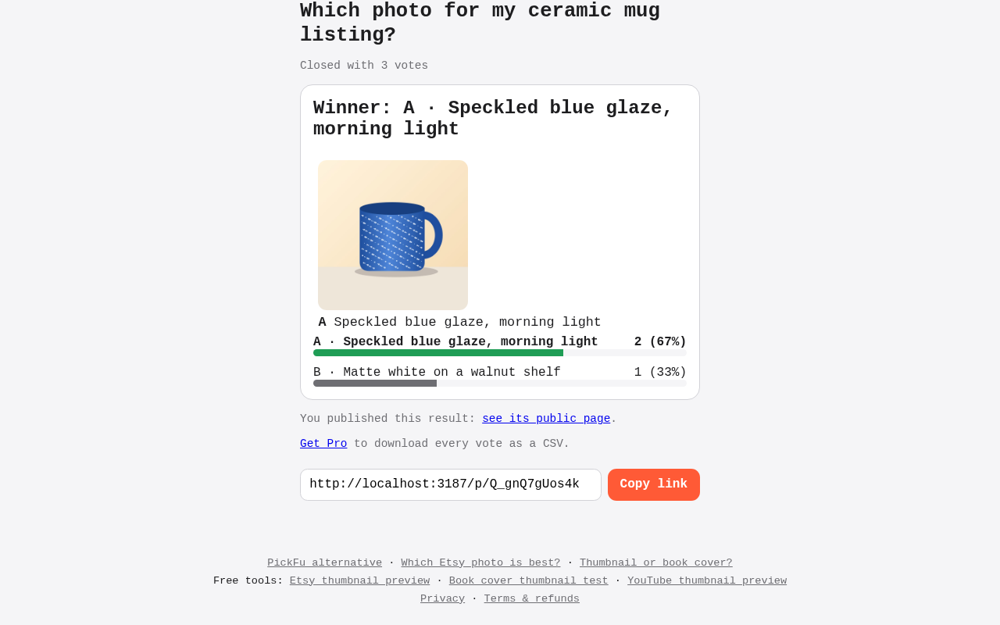
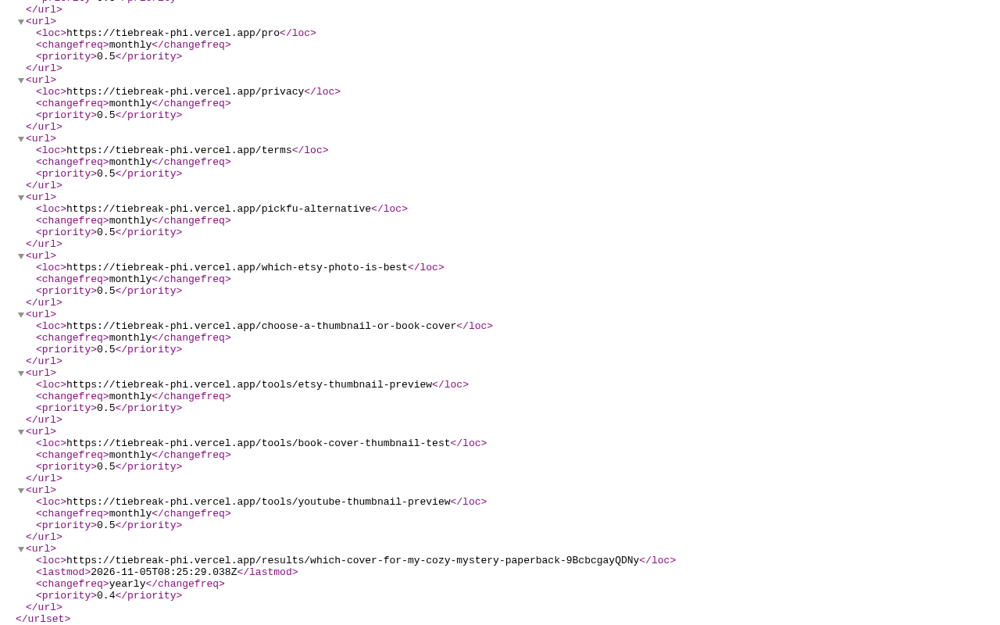

# tiebreak — swipe-to-decide polls for indecisive people and sellers

## Screenshots




A seller posts a poll with a photo for each option and ticks the new "Publish the result when it closes" box (it starts unticked, and a private poll can't have it).




Three strangers voted on the link and the poll closed. Its result now has a public page at `/results/<question-words>-<id>`: the question as `<title>` and `<h1>`, the winning photo, every option's votes and share (2 to 1), and "Make your own tiebreak".



The seller's own poll page links to the public page once it's up.



`/sitemap.xml` lists the result page after the public pages. Open, un-opted and reported polls stay out of it.

Regenerate them with `npm run screenshots` (set `CHROMIUM_PATH` to a Chromium binary; it starts the dev server on an in-memory database, with sample data only; the two mug photos are drawn in the browser). The poll page and the sitemap are taken once, at desktop size. `tests/result-pages-browser.test.ts` drives the same flow in Chromium.

People post two options, strangers swipe to pick one, and the poll closes at a vote target or deadline; sellers and creators pay a few dollars for a fast verdict instead of PickFu's $15+.

- [Research](RESEARCH.md) — findings and sources
- [PRD](PRD.md)
- [Roadmap](ROADMAP.md)
- [Native app](mobile/README.md): iPhone and Android (Expo), on the same API. Run it on your phone with Expo Go.

Effort: Medium · Confidence: Low

_Researched by the idea pipeline on 2026-10-11 ([original record](https://github.com/smithdavedesign/idea-factory/tree/main/ideas/tiebreak)); repo created on David's go-ahead 2026-10-11._

## Starter content (house polls)
The public feed is stocked with 40 funny "house" polls (`lib/house.ts`: horse-sized duck, is a hot dog a sandwich, …). Each question keeps one open public poll; when it closes, the next feed read posts a fresh copy, so the feed never runs dry. People's polls always come first, and anyone who voted on a house question doesn't see it again. Edit the list to change them; `HOUSE_POLLS=off` in the Vercel env turns them off.

## Hosting on Cloudflare Workers (being prepared)

The Vercel team is soft-blocked until 2026-11-30, so tiebreak can also run on Cloudflare Workers (free plan) through
the OpenNext adapter. Vercel ignores all of it (`wrangler.jsonc`, `open-next.config.ts`, the `cf:build`/`preview`/`deploy`
scripts), so both hosts build from the same code until the switch.

```bash
npm run cf:build                                   # next build, then .open-next/worker.js + static assets
npx wrangler dev                                   # run the built Worker locally (workerd); secrets from .dev.vars
provision cloudflare deploy tiebreak "$PWD"         # deploy with the broker (token from the keychain)
provision cloudflare secret tiebreak DATABASE_URL  # and STRIPE_PAYMENT_LINK, STRIPE_WEBHOOK_SECRET
```
`NEXT_PUBLIC_*` values are baked in at build time: build production with `NEXT_PUBLIC_SITE_URL=<its address>`.
`cf:build` sets `NEXT_PUBLIC_DEPLOY_ENV=production` itself, so the visit beacon counts the Worker's visitors
(`lib/beacon.ts` `deployEnv()`; on Vercel it reads `NEXT_PUBLIC_VERCEL_ENV`). On Workers each query or transaction
gets its own Postgres connection (`lib/db.ts`), since a socket can't outlive the request that opened it.
Screenshots of the built Worker running locally are in `docs/screenshots/cloudflare-local/`.
